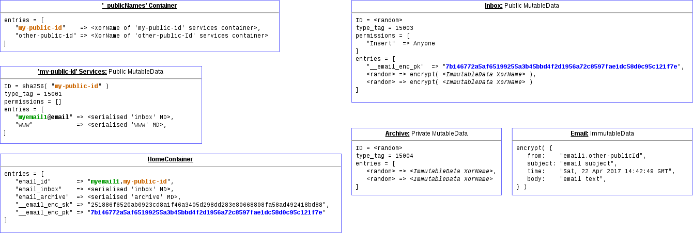

# **THIS MAIL TUTORIAL APPLICATION HAS BEEN DEPRECATED**

## The email example app is no longer supported.
The last known working version of this [v0.4.3](https://github.com/maidsafe/safe_examples/releases/tag/0.16.0) is configured to work with previous browser version [Peruse v0.7.0](https://github.com/maidsafe/safe_browser/releases/tag/peruse-browser-0.7.0).
This will no longer be maintained or updated to work with more recent versions of the SAFE Browser

## The Web Hosting Manager has been moved to its own repository. The latest release can be found [here](https://github.com/maidsafe/safe-web-hosting-manager-electron/releases/latest)


# Safe Mail Tutorial Application

The tutorial app show cases how to use the low level API from `safe_app_nodejs`
library to build a simple email application.

Demonstrates the usage of:
 - Private MutableData
 - Public MutableData
 - Immutable data
 - App's own container
 - `_publicNames` and services containers

Please refer to the [Application Data Model](#application-data-model) section below for additional details.

## Install

First, clone the repository:

```bash
$ cd your-project-name
```

And then install the dependencies:  

*Note:* You must use `npm` commands at the moment and not `yarn`: https://github.com/electron-userland/electron-forge/issues/249

```bash
$ npm install
```

If you are working on a development environment, you can run the command below instead, in order to get the `safe_client` libraries that use the `MockVault` file rather than connecting to the SAFE Network:

```bash
$ NODE_ENV=dev npm install
```

## Run

```bash
$ npm start
```

This starts the app in development mode with hot-reloading.

### Faking Authentication

If you don't have authenticator set up and want to run the test with randomly generated testing credentials, run it as:

```bash
$ NODE_ENV=dev SAFE_FAKE_AUTH=1 npm start
```

*Note: requires a node version >= 4 and an npm version >= 2.*

## DevTools

#### Toggle Chrome DevTools

- OS X: <kbd>Cmd</kbd> <kbd>Alt</kbd> <kbd>I</kbd> or <kbd>F12</kbd>
- Linux: <kbd>Ctrl</kbd> <kbd>Shift</kbd> <kbd>I</kbd> or <kbd>F12</kbd>
- Windows: <kbd>Ctrl</kbd> <kbd>Shift</kbd> <kbd>I</kbd> or <kbd>F12</kbd>

*See [electron-debug](https://github.com/sindresorhus/electron-debug) for more information.*


## Package

```bash
$ npm run package
```

To package apps for all platforms:

```bash
$ npm run package-all
```

To package apps with options:

```bash
$ npm run package -- --[option]
```

## Application Data Model

The following diagram depicts how the emails are stored in the SAFE network, as well as how the email app stores email accounts information.


